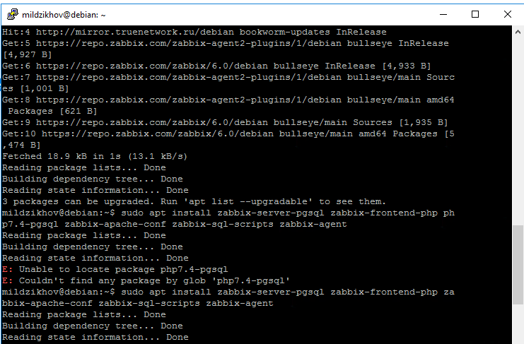
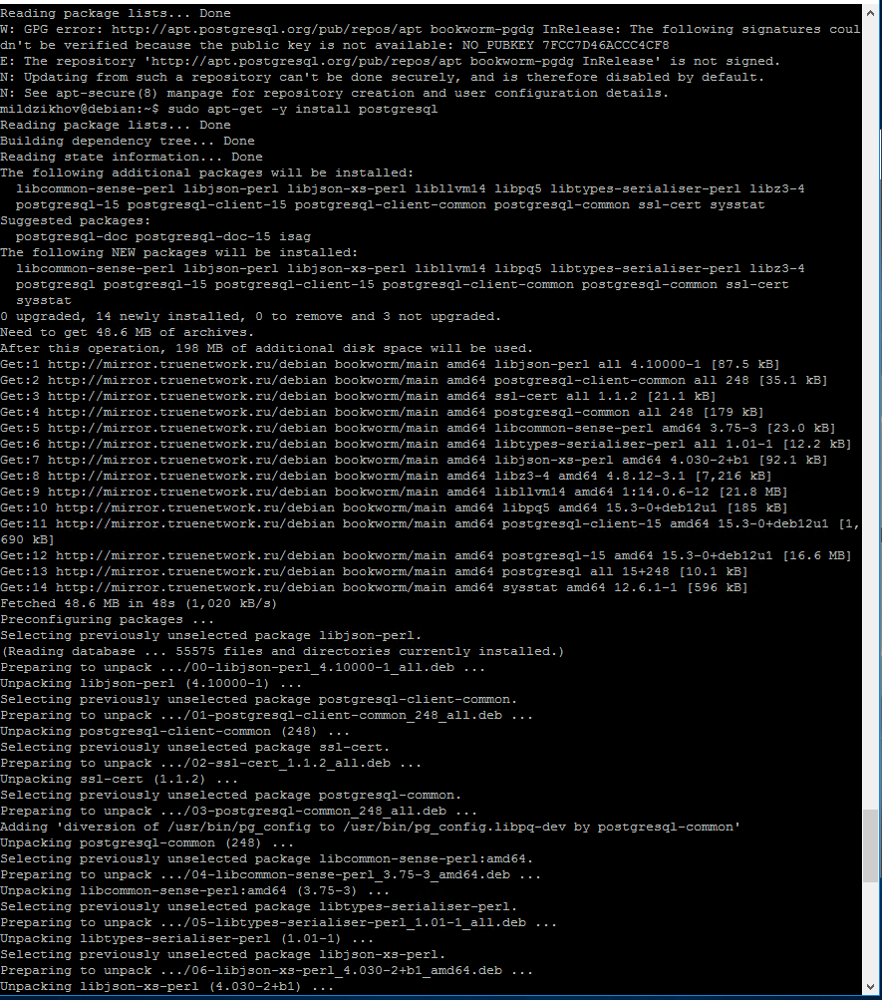
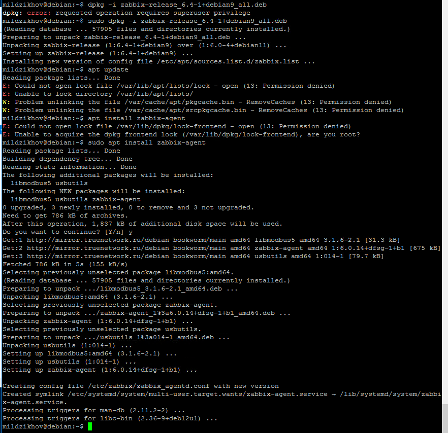
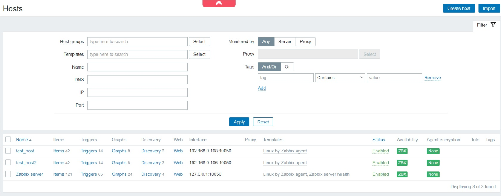
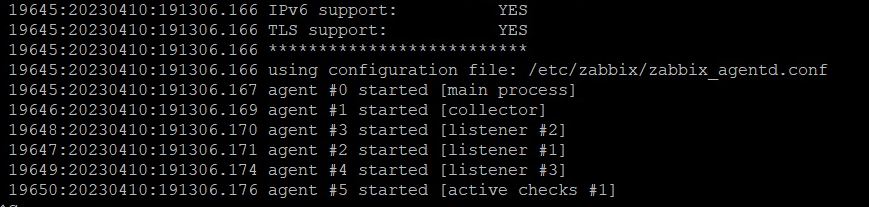
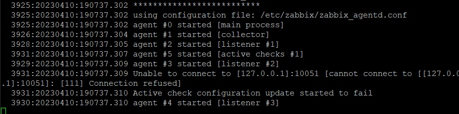
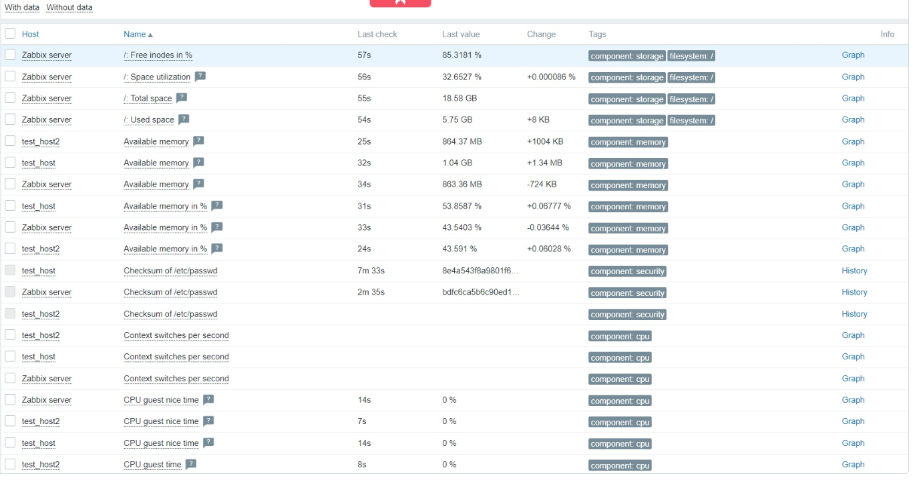

# Домашнее задание к занятию "`Система Мониторинга Zabbix`" - `Мильдзихов Сергей`

### Инструкция по выполнению домашнего задания

   1. Сделайте `fork` данного репозитория к себе в Github и переименуйте его по названию или номеру занятия, например, https://github.com/имя-вашего-репозитория/git-hw или  https://github.com/имя-вашего-репозитория/7-1-ansible-hw).
   2. Выполните клонирование данного репозитория к себе на ПК с помощью команды `git clone`.
   3. Выполните домашнее задание и заполните у себя локально этот файл README.md:
      - впишите вверху название занятия и вашу фамилию и имя
      - в каждом задании добавьте решение в требуемом виде (текст/код/скриншоты/ссылка)
      - для корректного добавления скриншотов воспользуйтесь [инструкцией "Как вставить скриншот в шаблон с решением](https://github.com/netology-code/sys-pattern-homework/blob/main/screen-instruction.md)
      - при оформлении используйте возможности языка разметки md (коротко об этом можно посмотреть в [инструкции  по MarkDown](https://github.com/netology-code/sys-pattern-homework/blob/main/md-instruction.md))
   4. После завершения работы над домашним заданием сделайте коммит (`git commit -m "comment"`) и отправьте его на Github (`git push origin`);
   5. Для проверки домашнего задания преподавателем в личном кабинете прикрепите и отправьте ссылку на решение в виде md-файла в вашем Github.
   6. Любые вопросы по выполнению заданий спрашивайте в чате учебной группы и/или в разделе “Вопросы по заданию” в личном кабинете.
   
Желаем успехов в выполнении домашнего задания!
   
### Дополнительные материалы, которые могут быть полезны для выполнения задания

1. [Руководство по оформлению Markdown файлов](https://gist.github.com/Jekins/2bf2d0638163f1294637#Code)

---

### Задание 1

Установите Zabbix Server с веб-интерфейсом.

### Процесс выполнения

Выполняя ДЗ сверяйтесь с процессом отражённым в записи лекции.

Установите PostgreSQL. Для установки достаточна та версия что есть в системном репозитороии Debian 11

Пользуясь конфигуратором комманд с официального сайта, составьте набор команд для установки последней версии Zabbix с поддержкой PostgreSQL и Apache

Выполните все необходимые команды для установки Zabbix Server и Zabbix Web Server

### Требования к результатам
Прикрепите в файл README.md скриншот авторизации в админке
Приложите в файл README.md текст использованных команд в GitHub

### Решение и команды
В процессе выполнения данного домашнего задания был установлен Zabbix Server и Zabiix Webserver, а также PostgreSQL с Apache.
Были использованы следующие команды:

1. sudo apt update  
2. wget https://repo.zabbix.com/zabbix/6.0/debian/pool/main/z/zabbix-release/zabbix-release_6.0-4+debian11_all.deb  
3. sudo dpkg -i zabbix-release_6.0-4+debian11_all.deb  
4. sudo apt update  
5. sudo apt install zabbix-server-pgsql zabbix-frontend-php php7.4-pgsql zabbix-apache-conf zabbix-sql-scripts zabbix-agent  
6. sudo -u postgres createuser --pwprompt zabbix  
7. sudo -u postgres createdb -O zabbix zabbix  
8. zcat /usr/share/zabbix-sql-scripts/postgresql/server.sql.gz | sudo -u zabbix psql zabbix  
9. nano /etc/zabbix/zabbix_server.conf параметр DBPassword=***  
10. sudo systemctl restart zabbix-server zabbix-agent apache2  
11. sudo systemctl enable zabbix-server zabbix-agent apache2  

### Ответ
`

`

`

`

`

`

---

### Задание 2

Установите Zabbix Agent на два хоста.

### Процесс выполнения
Выполняя ДЗ сверяйтесь с процессом отражённым в записи лекции.  
Установите Zabbix Agent на 2 виртмашины, одной из них может быть ваш Zabbix Server  
Добавьте Zabbix Server в список разрешенных серверов ваших Zabbix Agentов  
Добавьте Zabbix Agentов в раздел Configuration > Hosts вашего Zabbix Servera  
Проверьте что в разделе Latest Data начали появляться данные с добавленных агентов  
### Требования к результатам
1.Приложите в файл README.md скриншот раздела Configuration > Hosts, где видно, что агенты подключены к серверу
`
2. Приложите в файл README.md скриншот лога zabbix agent, где видно, что он работает с сервером

`

`
3. Приложите в файл README.md скриншот раздела Monitoring > Latest data для обоих хостов, где видны поступающие от агентов данные.

`

### Решение и команды
Был установлен Zabbix Agent на 2 виртуальные машины, Zabbix Server добавлен в список разрешенных серверов, добавил Добавьте Zabbix Agentов в HOSTS
1. sudo apt update
2. wget https://repo.zabbix.com/zabbix/6.0/debian/pool/main/z/zabbix-release/zabbix-release_6.0-4+debian11_all.deb
3. sudo dpkg -i zabbix-release_6.0-4+debian11_all.deb
4. sudo apt update
5. apt install zabbix-agent
6. systemctl restart zabbix-agent
7. systemctl enable zabbix-agent
8. sudo nano /etc/zabbix/zabbix_agentd.conf
9. systemctl restart zabbix-agent
